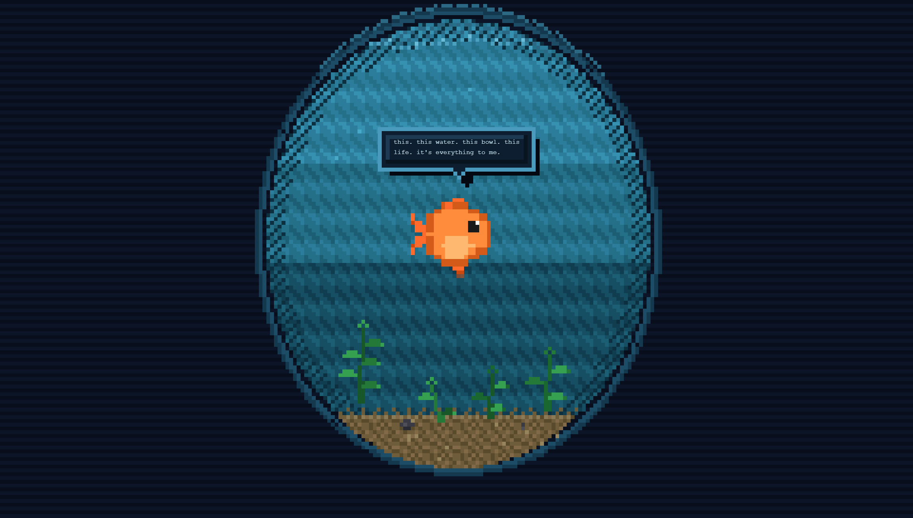

<div align="center">

# GlubLM

### *the language model that already forgot this sentence*

A 35-million-parameter transformer that pretends to be a goldfish. Hard-capped at a 96-token context. It literally cannot remember what you just said - and that's the point.

<p>
  <a href="https://den-sec.github.io/glublm/desk-pet/">
    
  </a>
  <a href="https://huggingface.co/DenSec02/glublm-18m">
    
  </a>
</p>

<p>
  
  
  
  
  
  
  
</p>



*GlubLM Desk Pet - a goldfish companion that lives in your browser and forgets you between sentences.*

</div>

---

## What is this?

**GlubLM** is three things:

1. **A tiny language model** (36.1M params, 40 MB ONNX) trained from scratch to impersonate a goldfish. Not a fine-tune of GPT-2 or anything else. Written in PyTorch, trained on a single RTX 3060, shipped to [HuggingFace](https://huggingface.co/DenSec02/glublm-18m), [PyPI](#pip-install-glublm), and your browser.

2. **A desk pet PWA** - a pixel-art goldfish that lives in a bowl in your browser, runs the full model client-side, swims around on its own, says things from a pool of 530 hand-curated idle phrases, and actually talks back when you poke it. Fully offline after first load. **[Adopt it here](https://den-sec.github.io/glublm/desk-pet/).**

3. **A companion server** - a full virtual pet system where the goldfish has biological needs (hunger, water quality, health), personality growth (bond level over weeks), and a split-screen architecture: an aquarium display on your monitor and a care controller on your phone. The fish lives on a server, gets hungry whether you're watching or not, and poops on the gravel.

The desk pet needs no backend. The companion needs a Node.js server (runs on any machine). Both use the same model and the same pixel-art engine.

## Why does this exist?

Most LLM projects chase capability. This one runs the other direction and chases **constraint**.

Inspired by Ted Lasso's meditation on the goldfish as "the happiest animal on earth" because of its 10-second memory, GlubLM makes forgetting a physical, architectural property of the model:

> **The context window is 96 tokens. Hard cap. No sliding window, no summarization, no KV cache tricks. After about two short sentences, the model has literally no access to what came before. It has to start over, every time.**

The result is a model that can't remember you, can't hold a grudge, can't accumulate bias across a conversation, and can't be convinced of anything. It's relentlessly present. Every interaction is its first. That's not a limitation we're working around - that's the whole point.

And then we put it in a pixel-art bowl on your desk so you can see it happen.

## Try it in 30 seconds

| Option | What you get | How |
|--------|--------------|-----|
| **[Adopt the Desk Pet](https://den-sec.github.io/glublm/desk-pet/)** | Pixel-art goldfish, PWA installable, 530 idle phrases, chat with the fish, offline after first load | Open the URL. Click install if you want. |
| **Companion Server** | Full virtual pet with needs, personality, aquarium display + phone controller | `cd companion && npm start` then open `localhost:3210` |
| **[Simple browser chat](https://den-sec.github.io/glublm/)** | Minimal chat UI, same model | Open the URL. Type something. |
| **[HuggingFace Space](https://huggingface.co/spaces/DenSec02/glublm)** | Gradio interface | Open the URL. |
| **Python** | CLI + programmatic API | `pip install glublm && glublm chat` |

Everything is free, open source, and runs locally or in your browser. No sign-up, no API key, no paywall.

## The Desk Pet

> *A goldfish you adopt in your browser. It swims, it talks to itself, it forgets everything. You can talk to it and it'll respond - then forget. You can poke it and it'll wiggle. Leave it alone long enough and it'll fall asleep. Close the tab and it'll tap on the glass asking where you went.*

### What it does

- **Pixel-art goldfish** in a GBA-style fishbowl rendered on HTML canvas. 240px-wide internal buffer, nearest-neighbor upscale to your viewport. 8x8 water tile patterns with 2-frame swap animation (the way Pokemon actually renders water). 3 depth zones, dithered refraction shadows, caustic light patterns on the gravel, 4 swaying plants.
- **12 animation states**: idle swim, talk, happy, sad, sleep, eat, bump glass, forget, excited, wiggle, bubble blow, turn around. Sprites are procedurally generated at 16x16 so every pixel is intentional.
- **530 hand-curated idle phrases** in 13 time-aware categories. The goldfish is different in the morning than at night. It gets bored if you ignore it. It gets philosophical at random.
- **Real chat with the model**. When you type something, the fish swims to the center, thinks for 1-3 seconds (ONNX Runtime Web on WASM), and speaks back. Then it forgets everything you both just said.
- **Click the fish** to make it wiggle, double-click for excited, long-press for happy. Click the water for a splash.
- **Installable PWA**. First visit downloads the 40 MB model once. After that it runs fully offline. Add it to your home screen and forget it's there until you open a new tab.
- **Notifications**. The goldfish taps on the glass when you're away. "hey! where did you go?" "the water is nice today." "i forgot what i was going to say." (Note: no push server, so notifications only fire while the browser is running.)
- **Settings**: name your fish, tune notification frequency (0-8 per day), done. Everything persisted in `localStorage`.

### How it's built

| Layer | Tech |
|-------|------|
| **Rendering** | HTML5 Canvas 2D, no libraries, ES modules, no build step |
| **Inference** | [ONNX Runtime Web](https://onnxruntime.ai/docs/tutorials/web/) (WASM backend), ~1-3s latency per response |
| **Model** | GlubLM v0.3.1 (36.1M params, INT8 quantized to 40 MB) |
| **Tokenizer** | Custom Byte-Level BPE decoder in vanilla JS (no tokenizer.js dependency) |
| **PWA** | Web App Manifest + Service Worker with streaming cache for the 40 MB model |
| **Offline** | Cache-first strategy, two caches: static assets (20 files) + model (streaming fetch) |
| **State** | Finite state machine with priority transitions, procedural sprite engine with cached frames |

Total: **~2,250 lines of vanilla JS across 10 modules**. No React, no build tooling, no transpiler, no framework. Just ES modules served statically.

### Architecture

```
  +--------------------------------------------------+
  |            desk-pet/ (PWA, ~2250 LOC)            |
  |                                                  |
  |  +------------------+  +---------------------+   |
  |  |  Canvas pixel    |  |    Service Worker   |   |
  |  |  buffer (240px)  |  |  (offline + model   |   |
  |  |  + screen upscale|  |   streaming cache)  |   |
  |  +--------+---------+  +---------------------+   |
  |           |                                      |
  |  +--------+------------------------------------+ |
  |  |  Engine (8 ES modules)                      | |
  |  |   bowl  sprites  movement  state-machine    | |
  |  |   bubbles  speech  idle  canvas             | |
  |  +---------------------------------------------+ |
  |           |                                      |
  |  +--------+------------------------------------+ |
  |  |  ONNX Runtime Web (WASM)                    | |
  |  |   -> glublm_35m_v4.onnx (40 MB, INT8)       | |
  |  +---------------------------------------------+ |
  +--------------------------------------------------+
         |                                   |
         v                                   v
    No backend                         Your browser tab
    No API calls                       (fully offline after 1st load)
```

## The Companion

> *The same goldfish, but now it needs you. It gets hungry. Its water gets dirty. It poops on the gravel. Leave it alone for a day and you'll come back to a belly-up fish floating at the surface. Feed it, clean its bowl, play with it, and it slowly starts to trust you.*

The companion system evolves the desk pet from a standalone demo into a persistent virtual pet with biological needs and personality growth.

### How it works

A Node.js server manages the pet's state and runs AI inference. Two browser clients connect via WebSocket:

- **Aquarium** (`localhost:3210/aquarium/`) - full-screen bowl rendering. Same pixel-art engine as the desk pet. Shows the fish, dirty water, poop, food flakes, algae. Display only.
- **Controller** (`localhost:3210/controller/`) - mobile-first care interface. Status bars, action buttons that re-sort by urgency, chat input. Designed for your phone.

### Needs system

| Stat | Behavior |
|------|----------|
| **Hunger** | Drains over ~24h. Feed to restore (+25%). 3 rapid feeds allowed, then 30 min cooldown. Overfeed = bloat. |
| **Water quality** | Drains over ~83h, faster with poop (+0.3/hr each). Change water to reset. Clean poop individually. |
| **Health** | Recovers at +4/hr when fed and clean. Drops when starving or filthy. Below 10% = belly-up (fish floats upside down). Always recoverable. |
| **Happiness** | Derived from hunger + water + interactions + health. Play with the fish to boost it. |
| **Bond** | Long-term stat (weeks to months). Grows from consistent care, shrinks from neglect. Affects fish behavior: stranger fish hides, bonded fish wiggles when you appear. |

### Quick start

```bash
cd companion
npm install
npm start
# Aquarium:  http://localhost:3210/aquarium/
# Controller: http://localhost:3210/controller/
```

## The Model

### Architecture

GlubLM is a **decoder-only transformer**, 8 blocks x hidden 640, modern stack all the way down:

```
input -> RMSNorm -> CausalAttention(RoPE on Q/K) -> residual
      -> RMSNorm -> SwiGLU FFN                    -> residual -> output
```

No bias terms anywhere. Weight-tied LM head. BF16 training. Pre-norm layout. Llama-style.

| Component | Value |
|-----------|-------|
| Parameters | 36,055,680 (36.1M) |
| Blocks | 8 |
| Hidden dim | 640 |
| Attention heads | 10 (64 per head) |
| FFN intermediate | 1280 (SwiGLU, effective 2560) |
| Vocab | 5,120 (Byte-Level BPE) |
| **Max context** | **96 tokens (hard cap)** |
| Training dtype | BF16 |
| Dropout | 0.1 |

Full details in [`docs/ARCHITECTURE.md`](docs/ARCHITECTURE.md).

### Dataset

55K balanced samples, generated by a team of four coordinated Claude agents instead of hand-authored templates:

- **Generator** (Haiku 4.5): produces conversations in batches, 50 samples per API call
- **Critic** (Sonnet 4.6): reviews each sample for persona adherence, returns accept/reject/fix
- **Diversifier** (Haiku 4.5): flags n-gram repetition across batches
- **Guardian** (Sonnet 4.6): hard filter that rejects any sample containing Ted Lasso characters, football/coach references, or other forbidden concepts

The final mix:

| Component | Samples | Character |
|-----------|---------|-----------|
| v1 (best subsample) | 20K | Poetic foundation |
| v2 (supplement) | 15K | Balance |
| v3 (conversational) | 5K | Companion tone |
| v4 (forgetful) | 15K | Obligatory mid-sentence forgetting |
| **Total** | **55K balanced** | 21% forgetting, 62% questions, 31% interjections |

Full methodology in [`docs/DATASET.md`](docs/DATASET.md).

### Training

Trained on a single **RTX 3060 12GB** in BF16, 15 epochs on 55K samples, AdamW with cosine schedule + 5% warmup, LR 3e-4 peak, batch 64, weight decay 0.1, gradient clipping 1.0.

Final test perplexity: **3.28**. Loss 3.18 -> 1.21 over the full run.

Full hyperparams and logs in [`docs/TRAINING.md`](docs/TRAINING.md).

## GlubLM vs GuppyLM

GlubLM is directly inspired by [GuppyLM](https://github.com/arman-bd/guppylm) (~8.7M params, template-composed dataset, vanilla transformer). GlubLM explicitly tests the design choices GuppyLM argued against.

| Dimension | GuppyLM | **GlubLM** |
|-----------|---------|------------|
| Parameters | 8.7M | **36.1M** |
| Layers x Hidden | 6 x 384 | **8 x 640** |
| Activation | ReLU | **SwiGLU** |
| Normalization | LayerNorm | **RMSNorm** |
| Position encoding | Learned | **Rotary (RoPE)** |
| Vocabulary | 4,096 | **5,120** |
| Context length | 128 | **96 (hard cap)** |
| Dataset | 60K templates | **55K LLM-generated** |
| Training | Colab T4 | **RTX 3060 local** |
| Browser demo | Basic chat | **Full PWA desk pet** |
| License | MIT | **AGPL-3.0** |

GuppyLM explicitly chose vanilla transformer components, arguing modern ops don't help below 40M params. GlubLM tests that empirically. Full results and qualitative samples in [`docs/COMPARISONS.md`](docs/COMPARISONS.md).

**TL;DR of the comparison**: at 36M params, modern ops (RoPE + SwiGLU + RMSNorm) produce noticeably more coherent persona-locked outputs, without costing anything.

## Quick start

### `pip install glublm`

```bash
pip install glublm

# Chat with the model (downloads weights from HF automatically on first run)
glublm chat --prompt "tell me about kindness"

# Or download manually
python -c "from huggingface_hub import hf_hub_download; \
  hf_hub_download('DenSec02/glublm-18m', 'model.safetensors', local_dir='./ckpt')"
```

### Train from scratch

```bash
git clone https://github.com/Den-Sec/glublm
cd glublm
pip install -e ".[dev,deploy]"

# Generate the dataset (requires ANTHROPIC_API_KEY)
glublm generate-data --target 55000 --out data/glublm_55k_v4.json

# Train
glublm train --data data/glublm_55k_v4.json --epochs 15 --batch-size 64 --lr 3e-4

# Sample from your trained checkpoint
glublm chat --ckpt checkpoints/glublm_35m_v4.pt --tokenizer checkpoints/tokenizer.json
```

Training takes ~15 minutes on an RTX 3060. See [`docs/TRAINING.md`](docs/TRAINING.md) for the full recipe and a Colab notebook.

### Build the Desk Pet locally

```bash
git clone https://github.com/Den-Sec/glublm
cd glublm
python -m http.server 8000 --directory desk-pet
```

Open `http://localhost:8000`. That's it. No npm, no bundler, no transpiler. Just static files.

## What's in this repo

```
glublm/
├── src/glublm/              # Python package: model, training, inference, CLI
├── data_gen/                # Multi-agent dataset generation pipeline
├── tools/                   # ONNX export, HF upload, benchmark
├── tests/                   # Pytest suite (77 tests green)
├── web/                     # Simple browser demo (legacy)
├── desk-pet/                # Pixel-art PWA desk pet (standalone, offline)
│   ├── engine/              # 8 ES module engine (canvas, bowl, sprites, ...)
│   ├── inference/           # ONNX model + BPE tokenizer in vanilla JS
│   ├── data/idle-phrases.json   # 530 curated goldfish phrases
│   ├── assets/icons/        # PWA icons
│   ├── manifest.json        # Web app manifest
│   ├── sw.js                # Service worker (offline + streaming model cache)
│   ├── model.onnx           # 40 MB quantized model (ships with the PWA)
│   └── tokenizer.json       # BPE tokenizer
├── companion/               # Virtual pet companion server (needs + personality)
│   ├── server/              # Node.js: state, needs engine, AI, personality, WS
│   ├── aquarium/            # Browser viewer (reuses desk-pet/engine/)
│   ├── controller/          # GBA-themed mobile care UI
│   ├── shared/              # Constants + WebSocket protocol
│   └── data/idle-phrases.json   # 730 phrases (530 original + 200 mood-aware)
├── hf/                      # HuggingFace model card + dataset card
├── space/                   # HuggingFace Space (Gradio)
├── notebooks/               # Colab training notebook
├── checkpoints/             # Trained weights (ignored, downloadable from HF)
└── docs/
    ├── ARCHITECTURE.md      # Model architecture deep dive
    ├── DATASET.md           # Multi-agent generation methodology
    ├── TRAINING.md          # Hyperparameters + training runs
    ├── COMPARISONS.md       # GlubLM vs GuppyLM, empirical
    └── superpowers/         # Design specs + implementation plans
        ├── specs/           # Feature specs
        └── plans/           # Phased execution plans
```

## Key numbers

| Metric | Value |
|--------|-------|
| Model parameters | 36,055,680 |
| Training dataset | 55K samples (LLM-generated, multi-agent) |
| Test perplexity | 3.28 |
| ONNX size (INT8) | 39.7 MB |
| Inference latency (WASM) | ~1-3s per response (desktop), ~3-5s (mobile) |
| Desk Pet LOC | ~2,250 (vanilla JS, 10 modules) |
| Companion LOC | ~2,800 (Node.js server + browser clients, 27 files) |
| Companion tests | 48 (node:test, 0 failures) |
| Idle phrases | 730 across 18 categories (530 desk pet + 200 companion) |
| Animation states | 12 (fish FSM) |
| Time the fish remembers you | ~10 seconds |

## Roadmap

- [x] Core transformer + training loop
- [x] Multi-agent dataset generation pipeline
- [x] ONNX export + browser inference
- [x] HuggingFace Hub model + dataset
- [x] PyPI package
- [x] HuggingFace Space
- [x] **Pixel-art desk pet PWA**
- [x] **Companion server** (needs system, personality, aquarium viewer, controller UI)
- [ ] Cloudflare Worker push relay (true background notifications)
- [ ] Dedicated hardware build (Raspberry Pi + small display, same engine)
- [ ] Hand-drawn sprite art (current ones are procedurally generated)
- [ ] Mobile app wrappers (iOS / Android)
- [ ] Fine-tuned variants (grumpy goldfish, poet goldfish, philosopher goldfish)

## Contributing

Contributions welcome. The project is small enough that one person can understand all of it.

**Good first issues**:
- Add a new idle phrase category
- Draw actual pixel art sprites to replace the procedural ones
- Port the engine to a second rendering backend (WebGL, WebGPU, framebuffer)
- Add a new animation state
- Test on iOS Safari and file PWA bugs
- Add more tests (the Python side has 77, the JS side has zero right now)

Before you start a large change, open an issue. The goldfish appreciates a heads-up.

## License

**AGPL-3.0-or-later**. If you run GlubLM as part of a network service, you are required to share your source code with your users. For most local or browser uses this changes nothing - it's for keeping the project genuinely open when wrapped in a commercial product.

See [`LICENSE`](LICENSE) for the full text.

## Acknowledgments

- **[GuppyLM](https://github.com/arman-bd/guppylm) by Arman BD** - the original tiny fish-persona model. Without it, this project wouldn't exist.
- **Ted Lasso** - "be a goldfish" is not just a line, it's a design constraint.
- **Anthropic Claude** - the multi-agent team that generated the dataset (Haiku + Sonnet).
- **[ONNX Runtime Web](https://onnxruntime.ai/docs/tutorials/web/)** team - for making 40 MB models runnable in a browser tab.
- **[HuggingFace](https://huggingface.co/)** - for hosting everything and making sharing small models zero-friction.
- Every pixel artist on the internet whose GBA water tile I studied to get the bowl to look right.

## Citation

If you use GlubLM in research, please cite:

```bibtex
@software{glublm_2026,
  author       = {Sepede, Dennis},
  title        = {GlubLM: a 36M goldfish language model with a 10-second memory},
  year         = {2026},
  url          = {https://github.com/Den-Sec/glublm},
  note         = {Includes Desk Pet PWA: https://den-sec.github.io/glublm/desk-pet/}
}
```

---

<div align="center">

### The goldfish would like to remind you that it doesn't remember reading this README.

**[Adopt the Desk Pet](https://den-sec.github.io/glublm/desk-pet/)** - [Companion Server](#the-companion) - [HuggingFace](https://huggingface.co/DenSec02/glublm-18m) - [Dataset](https://huggingface.co/datasets/DenSec02/glublm-60k-ted) - [Space](https://huggingface.co/spaces/DenSec02/glublm) - [Architecture](docs/ARCHITECTURE.md)

*Made with water, warmth, and a dangerous amount of pixel art.*

</div>
